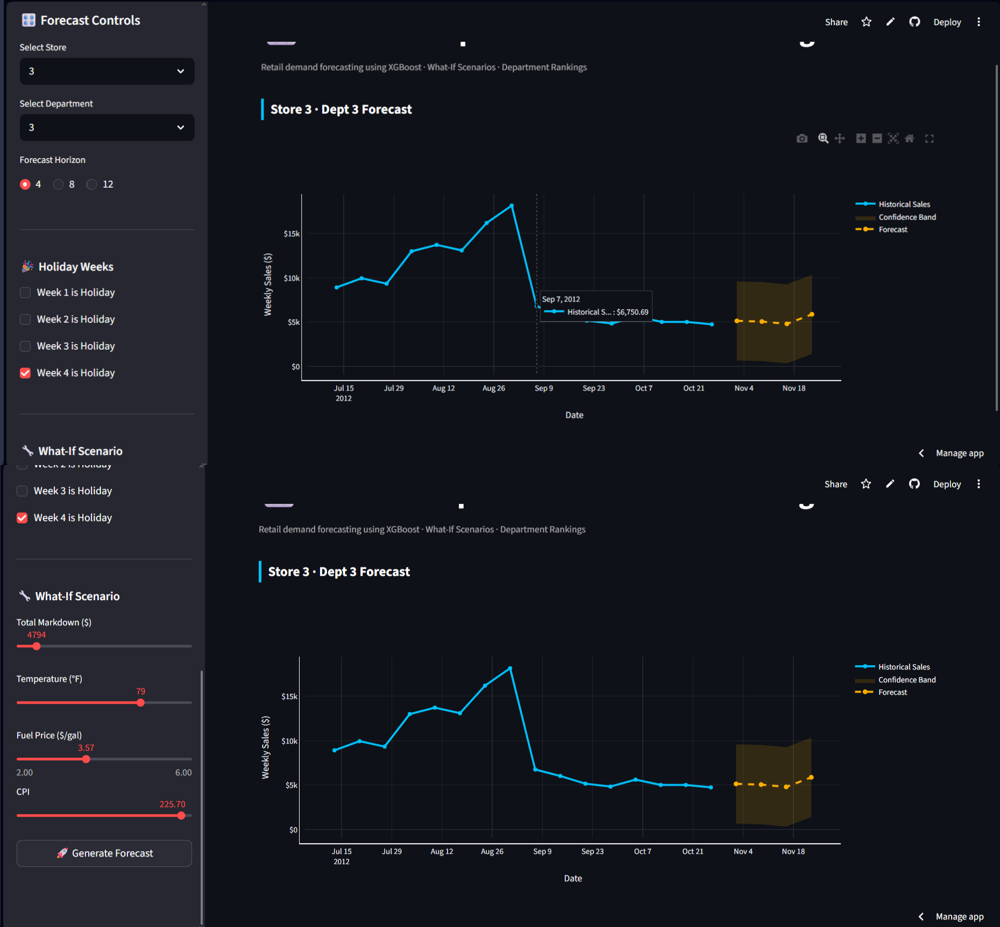

# 📈 Walmart Department Sales Forecasting

> End-to-end **revenue forecasting system** — predicting the next 4 weeks of weekly sales per store and department using recursive XGBoost and time-series feature engineering.

[](https://walmart-sales-forecasting-azim.streamlit.app/)


---

## 🚀 Live Demo

👉 **[walmart-sales-forecasting-azim.streamlit.app](https://walmart-sales-forecasting-azim.streamlit.app/)**

---

## 📸 App Preview



---

## 📌 Overview

Revenue and demand forecasting is a core problem in financial planning — from inventory budgets to workforce cost modeling. This project builds a production-grade forecasting pipeline on the **Walmart Retail Dataset** that:

- Forecasts **4 weeks of weekly sales** for any Store–Department combination
- Uses **recursive multi-step forecasting** — each predicted week feeds into future lag features
- Beats naive baseline by **~13% MAE** and **~18% RMSE**
- Deployed as a live interactive Streamlit app

---

## 📊 Model Performance

| Metric | XGBoost Model | Naive Baseline (lag_1) |
|---|---|---|
| MAE | **1,437** | 1,651 |
| RMSE | **3,106** | 3,776 |

- ~13% MAE improvement over baseline
- ~18% RMSE improvement over baseline
- Time-based train/test split — no data leakage

---

## 🔑 Top Predictors (Feature Importance)

| Feature | Importance |
|---|---|
| lag_1 (last week's sales) | 48% |
| rolling_mean_4 (4-week average) | 23% |
| lag_4 (last month's sales) | 12% |

Strong autoregressive behavior — short-term momentum dominates the signal.

---

## 🧠 Feature Engineering

**Lag features** capture recent sales history:
- `lag_1` — previous week
- `lag_4` — previous month
- `lag_12` — previous quarter

**Rolling features** capture trend and momentum:
- 4-week rolling mean
- 12-week rolling mean

**Calendar features** capture seasonality:
- Year, month, week number, day of week

**External economic indicators:**
- IsHoliday, Temperature, Fuel Price, CPI, Unemployment, MarkDown features, Store Type & Size

---

## 🔄 Recursive Forecasting Strategy

```
Week T (last known)
        ↓
  XGBoost Model  →  Predict Week T+1
        ↓
  Append T+1 to history  →  Rebuild lag features
        ↓
  XGBoost Model  →  Predict Week T+2
        ↓
  Repeat for T+3, T+4  →  4-week forecast horizon
```

This simulates real-world forward prediction without any access to future data.

---

## 🗃️ Dataset

| Property | Value |
|---|---|
| Source | Walmart Retail Dataset (Kaggle) |
| Time Range | Feb 2010 – Oct 2012 |
| Stores | 45 |
| Departments | Up to 99 per store |
| Features | Sales, holiday flags, economic indicators |

---

## 🛠️ Tech Stack

| Layer | Technology |
|---|---|
| Model | XGBoost Regressor |
| Feature Engineering | Pandas, NumPy |
| Validation | Time-based train/test split |
| Visualization | Matplotlib, Streamlit charts |
| Frontend | Streamlit |

---

## 💻 Run Locally

```bash
# 1. Clone the repo
git clone https://github.com/Azim521/Walmart-Sales-Forecasting.git
cd Walmart-Sales-Forecasting

# 2. Install dependencies
pip install -r requirements.txt

# 3. Run the app
streamlit run app.py
```

---

## 📁 Project Structure

```
Walmart-Sales-Forecasting/
├── app.py                      ← Streamlit forecasting app
├── requirements.txt            ← Dependencies
├── screenshot.png              ← App preview
├── processed_sales_small.csv   ← Preprocessed data sample
└── model/
    └── xgb_model.pkl           ← Trained XGBoost model
```

---

## 🔮 Future Improvements

- Hyperparameter tuning with time-series cross-validation
- Holiday-weighted MAE loss function
- Multi-store batch forecasting
- Prophet or LSTM comparison
- Extended forecast horizon (8–12 weeks)

---

## 📬 Contact

Built by **Azim Sadath**

[](https://www.linkedin.com/in/azim-sadath-a3ba34321/)
[](https://github.com/Azim521)
[](mailto:azimsadath521@gmail.com)
